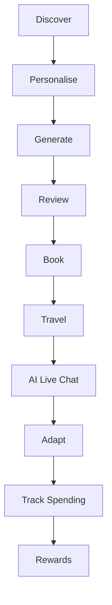
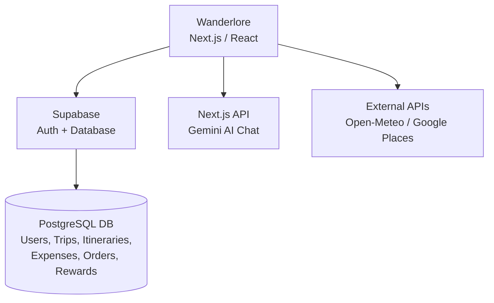

# Wanderlore

**Team:** Lim Shin Yin, Chuah Rui En, Tan Shin Yue, Yap Sheng Lih
**Problem Statement:** Travel Planner
**Video Presentation:** [Unlisted YouTube Link](link)
**Presentation Slides:** [Public Link](link)

---

## 1. Project Overview

### The Problem

- Travel planning can be time-consuming, complicated and fragmented.
- Travellers often need to switch between different platforms for:
  - Destination discovery
  - Flight and hotel searching
  - Itinerary planning
  - Maps and places
  - Weather information
  - Booking
  - Expense tracking
- Existing travel apps often focus on one specific stage of the travel journey rather than providing a seamless end-to-end experience.

### Causes of the Problem

- Too much information across different platforms.
- Travellers need to manually compare different options.
- Generic itineraries may not consider the traveller's actual needs.
- Group travellers may have different ages, preferences and physical limitations.
- First-time / younger travellers may not know how to efficiently organise a trip.
- Changes in weather or circumstances can make a planned itinerary less suitable.

### Stakeholders

- **Travellers** — Main users of the platform. Need convenient and personalised trip planning.
- **Travel companions / family members** — Need to coordinate activities and travel plans.
- **Hotels and accommodation providers** — Potential booking/service providers.
- **Airlines and transportation providers** — Provide flights and transportation options.
- **Tour / activity providers** — Provide attractions, tours and activities.
- **Travel service platforms** — Provide external travel-related services and information.

### Similar Apps in the Market

**1. Wanderlog**
What it does well: day-by-day itinerary planning, interactive maps, route planning, travel time between locations, hotel/flight reservations, budget tracking, collaboration, AI travel assistance.
Why it falls short: very comprehensive but mainly focused on managing and organising a trip that the user already knows they want. Our concept places more emphasis on personalised planning based on traveller profiles (group composition, children/adults/elderly, physical limitations, personal preferences), and starts from travel *discovery* rather than requiring the user to already know what they want to plan.

**2. TripIt**
What it does well: organises flight, hotel and reservation info into a centralised itinerary, provides alerts, helps manage a trip after booking.
Why it falls short: stronger at organising an already-booked trip; less focused on helping users decide where to go, what to do, and how to build a personalised itinerary from scratch.

**3. Roadtrippers**
What it does well: route planning, places/attractions discovery, AI-assisted trip planning, strong focus on road trips.
Why it falls short: primarily designed around road-trip/route-based travel. Our platform targets a broader range of travellers and considers the individual needs of the travelling group.

### Market Gap

Existing apps have many strong individual features, but users still need to combine several tools for discovering a trip, personalising it, generating an itinerary, booking, managing expenses, and getting travel assistance. **Our opportunity:** combine these stages into one beginner-friendly, end-to-end travel planning experience.

### Our Solution

An AI-powered personalised travel planning platform that helps users go from discovering a destination → planning → booking → managing their trip. Users provide information about their destination, travel group, number of adults/children/elderly, preferences and physical limitations, and the AI uses this to generate a personalised day-by-day itinerary. The platform also integrates weather, places and maps to support decision-making throughout the trip.

**Core User Journey:** Discover → Personalise → Generate → Customise → Book → Track → Assist

### ⭐ Killer / Key Features

1. **AI Personalised Itinerary** — generates a day-by-day plan, adapted to the user's preferences, travel group and physical constraints.
2. **Personalised Travel Survey** — collects destination, group type, traveller counts, physical limitations and preferences before generation.
3. **Social-style Travel Discovery Feed** — browse seasonal trips, popular destinations and deals; add interesting options directly to a trip.
4. **AI Live Travel Assistant** — trip-context-aware Q&A that responds to changing travel conditions.
5. **Weather-aware Travel Assistance** — surfaces weather info and suggests alternatives when conditions are unsuitable.
6. **Add-to-Trip Itinerary** — add AI-recommended activities directly into the itinerary, no manual copying.
7. **Integrated Booking Flow** — itinerary → booking → summary → confirmation in one flow.
8. **Expense Tracking** — record actual spending and compare against the planned budget.
9. **Maps & Places Integration** — location-based discovery to support planning.

---

## 2. Ideation & Process

### 2.1 Ideas We Considered

| Idea | Decision | Why |
|---|---|---|
| Personalised AI itinerary generator | ✅ Chosen | Directly reduces the time needed to research and organise a trip by combining destination, interests, pace, group size and budget into one plan. |
| Budget and expense tracker | ✅ Chosen | Budget is a major constraint for young travellers; tracking actual vs planned spend makes the itinerary more practical. |
| AI travel concierge / live chat | ✅ Chosen | Lets users ask questions during the trip instead of searching across multiple apps. |
| Weather-aware itinerary adaptation | ✅ Chosen | Makes Wanderlore more than a static itinerary generator — the plan can react to unexpected conditions such as rain. |
| Nearby-place recommendations | ✅ Chosen | Helps users find alternatives such as restaurants, attractions or facilities based on their current situation. |
| Group preference collection | ✅ Chosen | Travelling with others often creates conflicting preferences; collecting group info lets the plan better fit everyone. |
| Social-media-style travel package feed | ✅ Chosen | An engaging way for young travellers to discover destinations before starting a trip. |
| Rewards, vouchers and referral system | ✅ Chosen | Encourages continued engagement and gives budget-conscious users additional value. |
| Fully automated booking platform | ⚠️ Scoped down | Useful, but integrating real payment/hotel/flight systems is unnecessary complexity for a prototype — we demonstrate the booking *flow* without a full marketplace backend. |
| Real-time group collaborative editing | ⚠️ Scoped down | Valuable for group travel, but real-time multi-user sync needs extra backend infra. We prioritised collecting group preferences and generating one shared plan first. |
| Standalone social travel community | ❌ Dropped | Interesting for engagement, but a full social platform would significantly increase scope without solving the core planning problem. |
| Full travel-agent replacement | ❌ Dropped | Too broad for this project's scope — we focus on reducing repetitive planning work, not replacing human travel professionals. |

### 2.2 Ideation Boards

**Initial Brainstorm**

*Our earliest brainstorm covering concepts like a "spin wheel" for random destinations, live replanning, geo-scheduling, fatigue alerts, guide matching, and a "local trust" Q&A layer. Some of these (spin wheel, culture tales) were later dropped or scoped down as we narrowed toward the core planning flow.*

**Final User Flow**

### 2.3 Mentor Consultation

| Date | Mentor | Feedback Received | What Was Changed |
|---|---|---|---|
| - | - | - | - |

---

## 3. Design & Prototype

**UI Prototype:** [https://wanderlore-site.vercel.app/](https://wanderlore-site.vercel.app/) *(open in an incognito window)*

| Screen | What it shows |
|---|---|
| Home / Discovery Feed | Seasonal travel packages, social-feed style browsing |
| Survey Wizard | Destination, group, physical limitations, budget & pace input |
| Generated Itinerary | Timeline cards with activities, hotels, guide match |
| My Trip Plan | Full itinerary + budget breakdown, AI chat entry point |

*(Swap in your own screenshots + captions here)*

---

## 4. What Makes It Different

| Novel Feature | Our Twist |
|---|---|
| ⭐ Traveller Profile-Based AI Planning | AI considers *who* is travelling, not just the destination. |
| ⭐ Physical-Constraint-Aware Planning | Considers mobility limitations and different age groups within a travel group. |
| ⭐ Social-style Travel Discovery Feed | Combines inspiration/discovery with direct trip planning. |
| ⭐ Discovery-to-Booking Workflow | Connects discovery → personalisation → AI planning → itinerary → booking. |
| ⭐ Context-Aware AI Travel Assistant | AI uses the user's profile, itinerary and live travel info rather than acting as a generic chatbot. |

---

## 5. Technical Architecture & Feasibility

### Tech Stack

| Feature area | Tech / Service | Why | Constraints |
|---|---|---|---|
| Frontend | Next.js + Tailwind | Already our foundation, deploys easily | — |
| Hosting | Vercel | Native Next.js support, free tier, auto-deploy on push | Free tier has function timeout/usage limits |
| Auth | Supabase Auth | Free, built-in email/password, ties directly into our Postgres DB | Must write RLS (row-level security) policies ourselves, or users could see each other's data |
| Database | Supabase (Postgres) | One place for users, trips, itineraries, orders, expenses, rewards, vouchers | Free tier has storage/row limits + project pauses after inactivity |
| Backend logic | Next.js API routes | No separate backend server needed | Serverless cold starts on free hosting |
| AI itinerary + chat | Google Gemini API | Generous free quota, already integrated | Occasional malformed JSON — handled with retry logic |
| Destination picker | Google Maps Platform (Geocoding + Places API) | Reliable global place data, real geolocation | Requires a billing-enabled Google Cloud account even on free tier (no charge under quota) |
| Weather replanning | OpenWeatherMap API (or similar) | Simple REST, free tier | Rate-limited on free tier |
| Payments | None — checkout is fully mocked | Matches prototype scope | Could upgrade to Stripe test mode later if desired |
| Local guide matching | Mock data in a Supabase table | No real public API exists for this | Just our own seeded dataset |
| Rewards / referral / promo / voucher | Supabase tables + our own logic | Simple relational data, no 3rd party needed | Referral fraud prevention is a "nice to have," skipped for MVP |

### System Architecture Diagram

### Build Plan & Scope

**MVP (committed for the building phase):**
- Auth (sign up / login) via Supabase
- Personalised survey → AI-generated itinerary (Gemini)
- Trip plan display with budget breakdown
- AI live chat with weather-aware replanning
- Mock order/booking flow + My Orders history

**Stretch goals (if time permits):**
- Local guide matching
- Rewards / referral / promo / voucher system
- Map-based destination picker (Google Places)

---

## 6. Future Improvements

- Travel time estimation between hotel and destinations, considering transportation methods.
- Automatic departure reminders to prevent missed activities.
- Traffic-aware itinerary adjustments.
- Automatic itinerary adjustment when weather changes, delays occur, or attractions become unavailable.
- Schedule conflict detection for overly tight timing.
- Real-time booking integration with actual hotel/flight/activity services.
