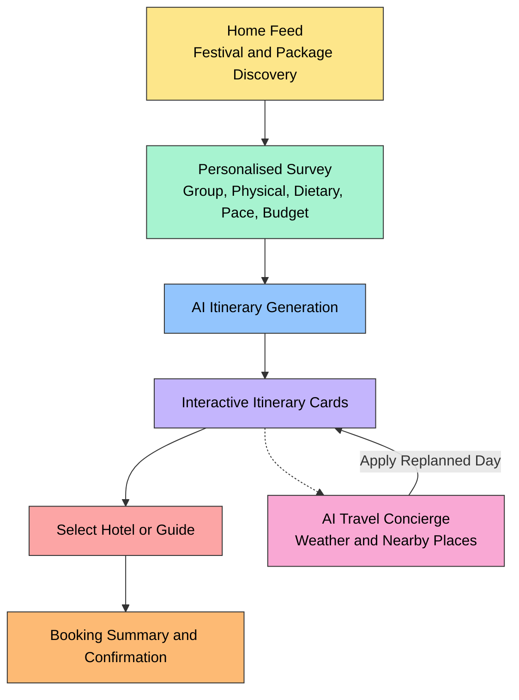
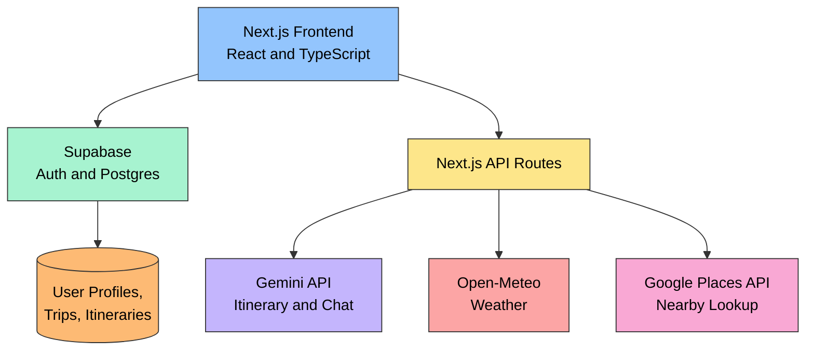

# Roamio by 404 Founders

**Team:** Lim Shin Yin, Chuah Rui En, Tan Shin Yue, Yap Sheng Lih
**Problem Statement:** Travel Planner
**Video Presentation:** [Unlisted YouTube Link]

---

## 1. Project Overview

### The Problem

Travel planning is time-consuming and fragmented, especially for groups whose members have different needs. Most existing platforms fall into one of two categories.

Booking platforms such as Trip.com and Klook offer a large selection of flights, hotels and activities, but the burden of matching those options to a specific traveller still falls on the user. Someone travelling with an elderly parent who cannot manage a steep hike, or a member of the group who keeps halal, gets no help from the platform in filtering for that — they have to read every listing themselves.

Generic AI assistants such as ChatGPT or Gemini can hold a conversation and offer personalised suggestions, but those suggestions stay in the chat window. There is no path from "here's an idea" to a structured plan the user can actually act on or book.

The result is a planning process split across several tools: destination discovery, itinerary building, hotel and activity selection, weather checks, maps, booking, and expense tracking each happen on a different app.

### Stakeholders

- **Travellers**, particularly those travelling with children, elderly companions, or physical limitations, who need planning that accounts for their actual constraints.
- **Travel companions and families**, who need the itinerary to work for everyone in the group, not just one person.
- **Local guides**, who currently have limited ways to reach travellers looking for authentic, locally-led experiences.
- **Hotels and accommodation providers**, who could be surfaced directly inside the planning process.
- **Tour and activity providers**, who supply the attractions and experiences that make up an itinerary.
- **Cultural festivals and local communities**, who stand to gain visibility among travellers planning trips around them.

### Similar Apps in the Market

| Existing Solution | What It Does Well | Where It Falls Short |
|---|---|---|
| Trip.com / Klook | Wide selection of flights, hotels and activities; strong search and booking | Users still have to manually judge whether an option fits their group's physical needs, diet, or preferred pace |
| Wanderlog | AI-assisted planning, maps, route planning, budgeting, collaboration | Strong at organising a trip, but does not proactively profile the traveller's constraints before generating a plan |
| TripIt | Consolidates flight, hotel and reservation details once a trip is already booked | Built for managing a trip that's already decided, not for helping someone figure out what to plan from scratch |
| Generic AI assistants (ChatGPT, Gemini) | Flexible, conversational, genuinely personalised advice | The advice stays as text in a chat — it never becomes a structured itinerary the user can act on |

### Market Gap

Each of these tools solves part of the journey well, but a traveller still has to move between several of them to get from an idea to a booked trip. Our aim is to connect the stages — discover, personalise, generate, customise, book, and assist — into a single continuous flow.

### Our Solution

Roamnio is an AI travel concierge that begins with the traveller, not the destination. Rather than opening to a blank search bar or chat box, the app first asks a short set of questions about who is travelling, their physical capability, dietary needs, preferred pace, and budget. That profile is then used to generate a full day-by-day itinerary, shown as interactive cards rather than a block of text.

From there, users can regenerate a day they don't like, pick a hotel directly from the itinerary, and see warnings on activities that may not suit their stated limitations. During the trip, an AI concierge stays available for live questions — weather, nearby amenities, what to do if it rains — and any suggestion it makes can be applied straight back into the itinerary with one tap.

**Core User Journey:** Discover → Personalise → AI Generate → Customise → Book → Travel → AI Assist

**Core feature set:**
- Multi-dimensional traveller profiling — physical capability, dietary restrictions, pace, budget, and group composition (children, adults, elderly)
- AI-generated structured itineraries covering day-by-day activities, hotel options, cost estimates, and physical-difficulty notes
- Interactive itinerary cards that can be regenerated per day rather than edited manually
- Physical-difficulty warnings tailored to what the user has actually stated about their group
- A real-time AI concierge that uses trip context alongside live weather and nearby-place data
- The ability to apply an AI suggestion directly to the saved itinerary, not just read it
- A mock end-to-end booking flow — hotel selection, summary, confirmation
- Expense tracking for recording actual spend against the trip
- A discovery feed for seasonal destinations, cultural festivals, and travel packages

---

## 2. Ideation & Process

### 2.1 Ideas We Considered

| Idea | Decision | Reason |
|---|---|---|
| Conversational onboarding with card-based UI | Chosen | Sets the experience apart from both static booking forms and generic chat |
| AI-generated structured itinerary | Chosen | Turns AI output into something actionable instead of a paragraph of advice |
| Physical-difficulty warnings | Chosen | Addresses a gap neither booking platforms nor chatbots currently cover |
| Real-time AI concierge | Chosen | Keeps the AI useful during the trip, not only while planning it |
| Weather and nearby-places integration | Chosen | Lets the concierge respond with real, current context |
| Swipe-to-regenerate itinerary | Chosen | Gives users a fast way to reject a day without starting over |
| Voucher, referral link, and reward points | Chosen | Supports repeat engagement and gives budget-conscious users added value; implemented in the current build |
| Local guide marketplace (registration and matching) | Deferred | A genuine two-sided marketplace needs guide onboarding, verification, and payouts — beyond what a single-user prototype needs to prove the core concept |
| KYC / identity verification | Deferred | Matters once real transactions are involved, but adds no value to demonstrating the core AI concierge |
| One-tap travel bundle | Deferred | Depends on commercial flight/hotel/activity APIs that are typically paid or partner-gated |
| Real-time travel-time estimation | Deferred | Needs a routing/transportation API beyond current scope |
| Flight and departure reminders | Deferred | Needs flight-status data and a notification system |
| Real-time flight price tracking | Dropped | Requires scheduled background jobs and additional external APIs; effort did not match how much it would strengthen the core pitch |

### 2.2 Ideation Boards

**Board 1 — Problem and Opportunity**

Early brainstorming on why travel planning feels fragmented and what different traveller groups actually need from a planner.

**Board 2 — Feature Ideation**

Broader exploration of AI planning, concierge assistance, booking, guide matching, and longer-term automation ideas.

**Board 3 — Feature Prioritisation**

Features sorted by user value against implementation effort, which is what shaped the line between the MVP and the Future Development section below.

### 2.3 Mentor Consultation

| Date | Mentor Feedback Received | What Was Changed |
|---|---|---|
| [Date] | [Fill in after session] | [Fill in after session] |

---

## 3. Design & Prototype

**UI Prototype:** [[Vercel deployment link]](https://roamio-site.vercel.app/)
*(Verified to open correctly in an incognito window)*

### User Flow

### Key Screens

**01 — Home Feed**

Seasonal festivals, travel packages, and destinations surfaced before the user starts planning a trip.

**02 — Personalised Survey**

Collects group composition, physical limitations, dietary needs, and preferences — the data that later drives AI warnings and itinerary choices.

**03 — AI Itinerary Generation**

A loading state while the AI builds a structured itinerary from the survey responses.

**04 — Interactive Itinerary Cards**

Day-by-day plan shown as cards with activities, costs, hotel options, and physical-difficulty notes. Swiping a card regenerates that day.

**05 — Booking Summary**

Consolidates the selected hotel, guide, and cost breakdown into one confirmation screen.

**06 — AI Travel Concierge**

Answers trip-related questions in real time and can apply a suggested change, such as a rain-day replan, directly to the saved itinerary.

---

## 4. What Makes It Different

**Conversational profiling instead of static forms.** Most platforms either skip profiling entirely or hand the user a long form. We collect the same information through a short, conversational flow that feels closer to talking to a concierge than filling in a questionnaire.

**Structured, actionable output instead of plain-text advice.** A generic AI assistant stops at a paragraph of suggestions. Ours returns structured data that becomes something the user can interact with directly — select a hotel, apply a replanned day — rather than something they have to read and re-enter elsewhere.

**Personalisation that carries through the whole trip.** The traveller's profile is not used once and discarded. Physical limits, dietary needs, and budget stay part of the trip context and inform every later interaction with the AI concierge, not just the first itinerary generation.

**A working link between advice and action.** When the concierge recommends a change, for example switching to indoor activities because of rain, the user applies it with one tap and it is reflected in their saved itinerary — not left as a suggestion they'd otherwise have to act on manually.

---

## 5. Technical Architecture & Feasibility

### Tech Stack

| Layer | Technology | Purpose | Why We Chose It | Known Limitation |
|---|---|---|---|---|
| Frontend/Backend | Next.js (App Router) + React + TypeScript | UI and API routes in one codebase | A unified full-stack framework suited to fast iteration under hackathon time constraints; UI scaffolded with v0 to speed up development | Requires standard build and deployment configuration |
| Auth & Database | Supabase (Postgres + Auth) | Stores user accounts, traveller profiles, trip plans, and (in future) guide profiles | Free tier, built-in email/password auth tied directly to Postgres | Must write our own Row-Level Security policies, or users could read each other's data; free tier has storage and row limits, and the project pauses after inactivity |
| AI | Gemini API via `@google/genai` SDK | Generates itineraries and powers the concierge chat | Native JSON-schema output, which is what makes card-based rendering possible without fragile text parsing | Daily request quota; occasional 503 responses under load, handled with an automatic retry-with-backoff wrapper |
| Weather | Open-Meteo | Supplies weather data for the concierge | No API key required, generous free usage | Less detailed than some commercial weather APIs |
| Maps/Places | Google Places API | Nearby-place lookups (e.g. "nearest toilet") | Reliable, broad place and location data | Requires a billing-enabled Google Cloud account even on the free tier, though usage under quota is free |
| Hosting | Vercel | Hosts the application | Connects directly to GitHub for automatic redeployment on push | Free tier has function timeout and usage limits |
| Version Control | GitHub | Source control | Standard for team collaboration and deployment integration | Needs disciplined branch and merge management with four people committing |

### Supabase in Detail

Supabase functions as the persistent data layer for the app. It currently stores, or is planned to store:

- User accounts and authentication
- Traveller profiles and stated preferences
- Generated trip plans and itineraries
- Bookings and expense records
- Local guide profiles, availability, and reviews (future)

The main constraint is the free tier's limits on storage, request volume, and the project pausing after a period of inactivity — a production version would need a paid plan.

### System Architecture Diagram

### One-Tap Travel Bundle — Current Limitation

A genuine one-tap bundle (hotel, flight, transport, and activities booked together) would need integration with external commercial travel APIs. Most of these require paid access or a formal partnership, which is not realistic within a hackathon budget. The current prototype demonstrates the booking flow with mock data instead of processing real transactions.

### Local Guide Matching — What It Would Require

The current build uses seeded mock guide profiles to show the matching interaction. A real, peer-to-peer version would need guide-side registration and authentication, a guide profiles table (languages, location, expertise, availability, pricing), a matching query against traveller requirements, identity verification, and a way to handle payouts — all of which is scoped to Future Development rather than the MVP.

### Build Plan & Scope

For the build phase, we focused on the core loop: traveller profiling, AI-generated structured itinerary, interactive card-based interaction (regenerate a day, select a hotel), a mock booking flow, and an AI concierge with live weather and places lookup that can apply changes back to the itinerary.

Commercial and infrastructure-heavy features — a full guide marketplace, KYC, real one-tap bundling, and real-time flight tracking — were intentionally left out of this build. That was a deliberate choice to protect time for the core AI experience rather than an oversight, and each is documented below as a clear next step.

---

## 6. Future Development

**Smart time management.** Estimate travel time between hotels and destinations, account for different transport methods and traffic conditions, detect scheduling conflicts, warn users when a day is packed too tightly, and send departure and flight-boarding reminders.

**Dynamic itinerary adjustment.** Automatically adjust the plan when weather changes, a flight is delayed, an attraction becomes unavailable, or two activities end up conflicting.

**One-tap travel bundle.** Let users purchase a full bundle — hotel, flights, transport, activities, and a local guide — directly from the generated itinerary, once budget allows access to the commercial APIs this depends on.

**Local guide marketplace.** Allow guides to register their own profiles (languages, location, expertise, tour types, availability, pricing, verification status), and match them to travellers based on destination, interests, language, group size, and budget. Concept: traveller profile and trip plan feed into a matching system, which surfaces suitable guides for a request or booking, followed by a review.

**Trust and safety.** KYC and identity verification, verified-guide badges, ratings and reviews, and a reporting or dispute mechanism, once the platform handles real bookings between strangers.

**Other improvements under consideration:** a travel checklist, currency exchange alerts, flight price tracking, real-time travel disruption notifications, and deeper booking integrations beyond the current mock flow.

Longer term, the goal is for the platform to grow from an itinerary generator into a full AI travel concierge — one that carries a traveller from profile, to AI-generated plan, to booking, to real-time assistance and adjustment during the trip itself, without the traveller needing to leave the app to manage any part of that journey.
